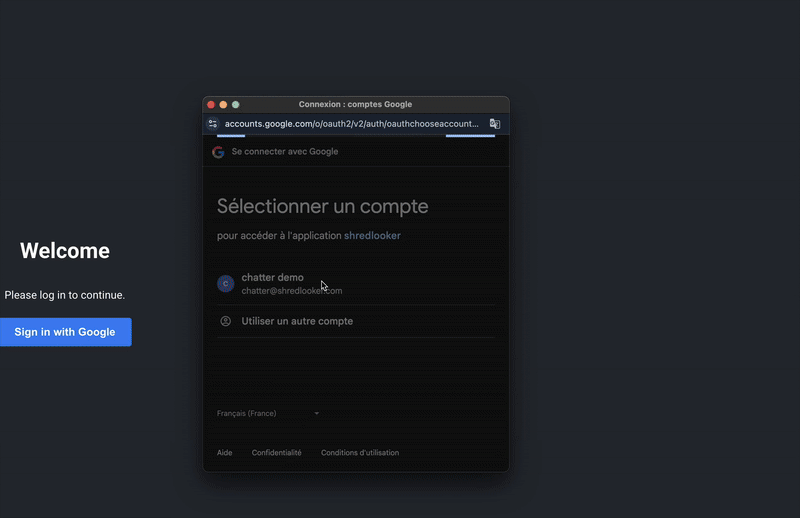

# Chatter React App Deployment Guide

### This document outlines the steps to deploy the Chatter React application to Google Cloud Run.

Chatter is a REACT application that allows a User to interact with a data warehouse either in BigQuery or under Looker using Natural Language.



## Prerequisites

### Google Cloud Platform (GCP) Account & Project Setup:

* ### A GCP account with billing enabled.

* ### A GCP project created.

* ### GCP User Authentication: The user performing the deployment must be authenticated in GCP.

### Required GCP Services Enabled:

* ### Cloud Run API

* ### Cloud Build API

* ### Container Registry API (automatically enabled with Cloud Build)

* ### BigQuery API (if using BigQuery agents)

* ### Looker Agent API (if using Looker agents)

* ### Google OAuth API

* ### Data QnA API (currently private preview)

Decide on a region where everything will be hosted, for example europe-west1

Chatter interacts with the Looker Agent API (in GCP known as Data QnA API, the one you enabled above)

The Agent API interacts with both Looker or BigQuery.

The general flow of the app is:

1. User authenticates with Google OAuth.  
2. User selects an Agent from the nav bar to interact with.  
3. User message is sent in request to Looker Agent API which ultimately responds and is populated in the chat experience. (summary text, chart etc.)

## User authenticates with Google OAuth.

In the GCP console, navigate to Credentials.  
[console.cloud.google.com/apis/credentials](http://console.cloud.google.com/apis/credentials)

Click \+ Create credentials \>\> OAuth client ID

**Application type:** Web application  
**Name:** Chatter

For now only add localhost:3000 to both **Authorized JavaScript origin** and **Authorized redirect URIs**. You will add the Cloud Run URIs later.

Take note of the Client ID. You can come back later though, so no worries if you leave this page.

## User selects an Agent from the nav bar to interact with.

There is a list of agents available to the end user in the nav bar on the left. This list is populated from a yaml file stored in a cloud bucket

It looks like this:

```
agents:
 - Fashion.ly Looker Agent:
     name: Fashion.ly Looker Agent
     type: looker
     model: thelook
     explore: order_items
     system_instructions: >
       - When there is a chart with 2 metrics, ensure there are 2 axes.
       - Only return a summary in the text output.
 - Order Items BQ Agent:
     name: Order Items BQ Agent
     type: bigquery
     bq_project_id: MY_GCP_PROJECT_ID
     bq_dataset_id: order_items
     bq_table_id: order_items
```

The Looker Agent API needs a Looker Client ID and Secret to interact with the LookML model. This is stored in an .env file.  
*Note, this file will not be deployed to Cloud Run, but will be used in the deployment.*  
It is recommended to create and use a dedicated "service account" within Looker for this purpose.

```
REACT_APP_GCP_CLIENT_ID=GCP_CLIENT_ID
REACT_APP_LOOKER_AGENT_API_URL=https://dataqna.googleapis.com/v1alpha1/projects/GCP_PROJECT_NAME:askQuestion
REACT_APP_GCP_PROJECT_NAME=GCP_PROJECT_NAME
REACT_APP_LOOKER_CLIENT_ID=LOOKER_CLIENT_ID
REACT_APP_LOOKER_CLIENT_SECRET=LOOKER_CLIENT_SECRET
REACT_APP_LOOKER_INSTANCE_URL=https://LOOKER_INSTANCE_URL.looker.app
```

## Set up Users in GCP (IAM)

### Users must have access to gemini and Looker and/or BigQuery. A preferred method is to create a Chatter group and assign users to that.

* ### Gemini for Google Cloud User:

  * ### If you intend to use Gemini for Google Cloud features, ensure your user has the appropriate permissions.

* ### Looker Viewer (if agents use Looker):

  * ### If your application interacts with Looker, ensure the user has the "Looker Viewer" role or equivalent permissions.

* ### BigQuery Job User (if agents use BigQuery):

  * ### If your application interacts with Looker, ensure the user has the "BigQuery Job User" role or equivalent permissions.

## 

## Deployment Steps

### Step 1: Authenticate & Set Project

1. Build your React application:

```
npm run build
```

### 

### Step 2: Authenticate & Set Project

1. ### Authenticate with your Google Cloud account:

```
gcloud auth login
```

### 

2. ### Set your active GCP project:

```
gcloud config set project GCP_PROJECT_NAME
```

### 

### Step 3: Enable Cloud Run & Required Services

### *This was already done at the start. If not the case, enable Cloud Run, Cloud Build, and any other required APIs:*

```
gcloud services enable run.googleapis.com cloudbuild.googleapis.com
```

### Step 4: Create a Dockerfile for Your React App

*This is already in the git repo. If not the case, create a Dockerfile in the root directory of your React project with the following content:*

Dockerfile

```
# Use Node.js to build the React app
FROM node:18-alpine as build
WORKDIR /app
COPY package.json package-lock.json ./
RUN npm install --production
COPY . .
RUN npm run build

# Use Nginx to serve the built React app
FROM nginx:alpine
COPY --from=build /app/build /usr/share/nginx/html

# Update Nginx to listen on port 8080 for Cloud Run
RUN sed -i 's/listen       80;/listen 8080;/' /etc/nginx/conf.d/default.conf

EXPOSE 8080
CMD ["nginx", "-g", "daemon off;"]
```

### Step 5: Build & Push the Docker Image (Without Local Docker)

Use Cloud Build to build and push the Docker image directly to Google Container Registry (GCR):

Bash

```
gcloud builds submit --tag gcr.io/GCP_PROJECT_NAME/chatter-react
```

Note: Ensure your project ID is correct in the image tag.

### Step 6: Deploy to Cloud Run

Deploy the Docker image to Cloud Run:

Bash

```
gcloud run deploy chatter-react \
    --image gcr.io/GCP_PROJECT_NAME/chatter-react \
    --set-env-vars REACT_APP_GCP_CLIENT_ID=GCP_CLIENT_ID
    --set-env-vars REACT_APP_LOOKER_AGENT_API_URL=https://dataqna.googleapis.com/v1alpha1/projects/GCP_PROJECT_NAME:askQuestion \
    --set-env-vars REACT_APP_GCP_PROJECT_NAME=GCP_PROJECT_NAME \
    --set-env-vars REACT_APP_LOOKER_CLIENT_ID=LOOKER_CLIENT_ID \
    --set-env-vars REACT_APP_LOOKER_CLIENT_SECRET=LOOKER_CLIENT_SECRET \
    --set-env-vars REACT_APP_LOOKER_INSTANCE_URL=https://LOOKER_INSTANCE_URL.looker.app \
    --platform managed \
    --region REGION_NAME \
    --allow-unauthenticated
```

* Replace GCP\_CLIENT\_ID with the Client ID you set up in Credentials.  
* Replace GCP\_PROJECT\_NAME with your project ID.  
* Replace REGION\_NAME with your preferred GCP region ie europe-west1  
* \--allow-unauthenticated allows public access to your application. If you require authentication, remove this flag and configure Google OAuth.

### Step 7: Get the URL

After deployment, Cloud Run will provide a URL in the console output. This URL is where your React app is live.

### Step 8: Redeploying After Changes

To redeploy your application after making changes:

1. Build your React application:

```
npm run build
```

2. Submit a new build to Cloud Build:

```
gcloud builds submit --tag gcr.io/GCP_PROJECT_NAME/chatter-react
```

3. Deploy the Docker image to Cloud Run:

Bash

```
gcloud run deploy chatter-react \
    --image gcr.io/GCP_PROJECT_NAME/chatter-react \
    --set-env-vars REACT_APP_GCP_CLIENT_ID=GCP_CLIENT_ID
    --set-env-vars REACT_APP_LOOKER_AGENT_API_URL=https://dataqna.googleapis.com/v1alpha1/projects/GCP_PROJECT_NAME:askQuestion \
    --set-env-vars REACT_APP_GCP_PROJECT_NAME=GCP_PROJECT_NAME \
    --set-env-vars REACT_APP_LOOKER_CLIENT_ID=LOOKER_CLIENT_ID \
    --set-env-vars REACT_APP_LOOKER_CLIENT_SECRET=LOOKER_CLIENT_SECRET \
    --set-env-vars REACT_APP_LOOKER_INSTANCE_URL=https://LOOKER_INSTANCE_URL.looker.app \
    --platform managed \
    --region REGION_NAME \
    --allow-unauthenticated
```

* Replace GCP\_CLIENT\_ID with the Client ID you set up in Credentials.  
* Replace GCP\_PROJECT\_NAME with your project ID.  
* Replace REGION\_NAME with your preferred GCP region ie europe-west1  
* \--allow-unauthenticated allows public access to your application. If you require authentication, remove this flag and configure Google OAuth.

### Terraform Deployment to come.